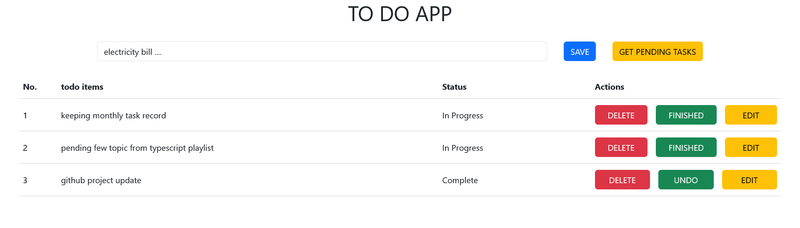

<h2>It has following feature</h2>
<ul>
  <li>todo save</li>
    <li>todo edit</li>
    <li>todo delete</li>
    <li>todo finished</li>
    <li>get pending todo list</li>
</ul>

<h2> Tech Stack used </h2>
<ul>
  <li>Javascript</li>
  <li>Bootstrap</li>
  <li>HTML</li>
</ul>

